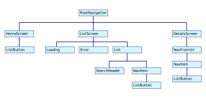

A Star Wars trivia application built with React Native. This app displays a homescreen from which you can navigate to different lists (films, characters, vehicles, starships, planets, and species).  Upon selecting an item in the list, it displays a details screen with information about that item, and links to details about other items associated with it.

Features
* Uses the Star Wars API ( https://swapi.dev )
* List pages that displays lists of all films, characters, vehicles, planets, etc.
* Detail page that displays metadata for films, characters, vehicles, planets, etc.
* Navigation between details pages.
* Search filter on list pages to filter displayed items.

This is the app's component tree diagram:

